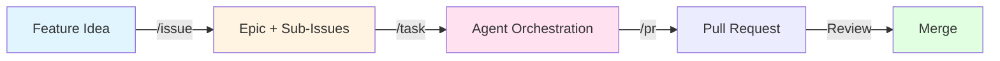
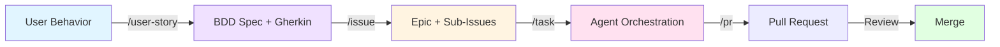
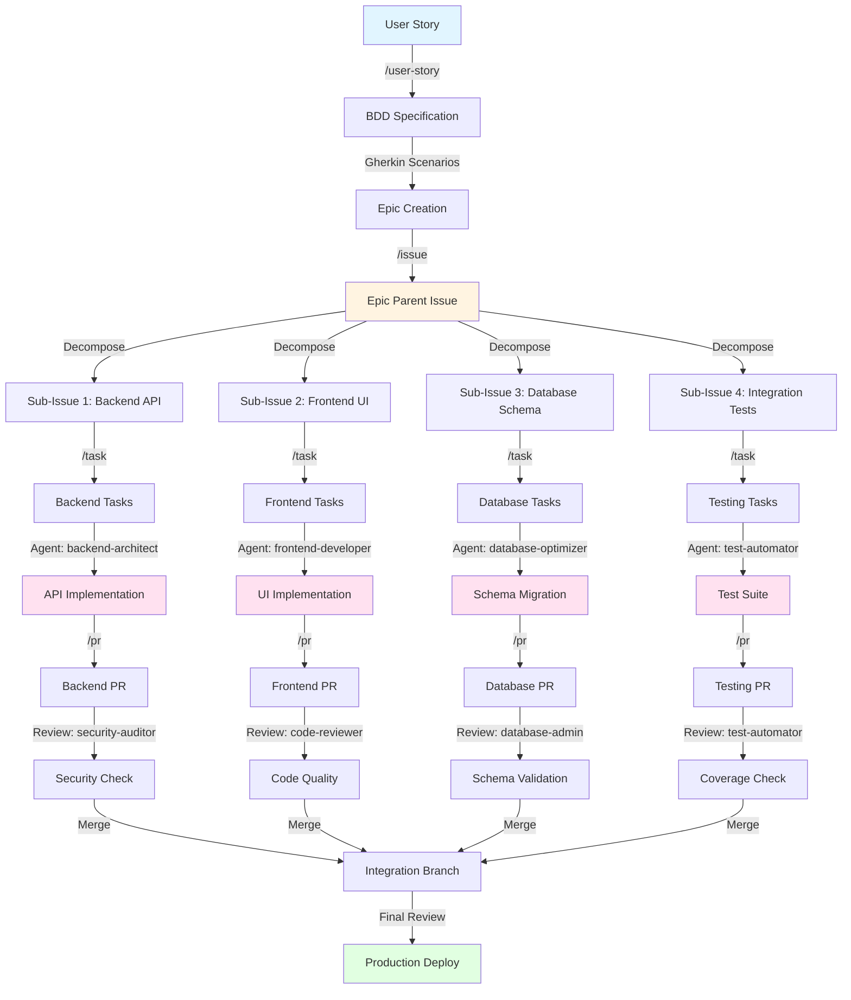
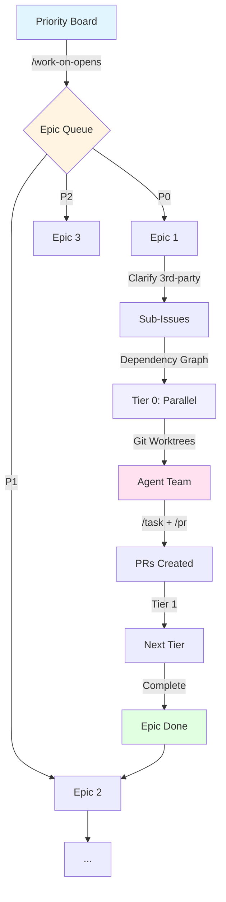

# Claude Code Configuration

Personal Claude Code configuration directory featuring 83+ specialized AI agents, custom skills, slash commands, GitHub
workflow automation, and multi-agent orchestration patterns.

## Table of Contents

- [Overview](#overview)
- [Development Methodologies](#development-methodologies)
    - [Individual: Issue-Driven Development](#1-individual-issue-driven-development)
    - [Behavioral: Behavior-Driven Development (BDD)](#2-behavioral-behavior-driven-development-bdd)
    - [Scaled: Epic-Driven Development (Agent Teams)](#3-scaled-epic-driven-development-agent-teams)
- [Features](#features)
    - [Specialized AI Agents](#-specialized-ai-agents)
    - [Custom Skills](#-custom-skills)
    - [Slash Commands](#-slash-commands)
    - [Multi-Agent Orchestration](#-multi-agent-orchestration-patterns)
- [Directory Structure](#directory-structure)
- [Quick Start](#quick-start)
- [Configuration](#configuration)
- [Resources](#resources)

## Overview

This repository extends Claude Code with:

- **83+ Specialized AI Agents** across Haiku/Sonnet/Opus model tiers for domain-specific expertise
- **10 Custom Skills** for specialized tasks (financial analysis, WebGL development, Claude Code customization)
- **13 Slash Commands** for GitHub workflows, architecture, requirements, research, and content generation
- **3 Development Methodologies** — Issue-Driven, BDD, and Epic-Driven (Agent Teams)
- **Multi-Agent Orchestration** patterns for complex development workflows
- **Session Persistence** across projects and shell environments

## Development Methodologies

This configuration supports three progressive development approaches, each building on the previous.

### 1. Individual: Issue-Driven Development

**Flow:** `/issue` -> `/task`

The most direct approach. Define features as structured GitHub issues with acceptance criteria, then execute with agent
orchestration.



```bash
/issue "Add payment processing"
# -> Epic #100 + Sub-issues #101, #102, #103
#    with acceptance criteria, story points, agent assignments, dependency graphs

/task #101
# -> Agents implement, test, validate

/pr
# -> PR linked to #101
```

**Best for:** Technical features where requirements are clear and you want fast decomposition-to-implementation.

---

### 2. Behavioral: Behavior-Driven Development (BDD)

**Flow:** `/user-story` -> `/issue` -> `/task`

Starts from user behavior, formalizes it in Gherkin syntax, then decomposes and implements.



```bash
/user-story
# -> Defines persona, goal, benefit
# -> Creates Gherkin scenarios (Given/When/Then)
# -> Sets semantic version target
# -> Creates GitHub issue with BDD specification

/issue "Implement user authentication"
# -> Decomposes BDD story into implementable sub-issues
# -> Maps scenarios to acceptance criteria

/task #124
# -> Agents implement against Gherkin scenarios
# -> Validates behavior matches specification
```

**Best for:** User-facing features where behavior must be formalized before implementation, or when working with
non-technical stakeholders.

#### Full BDD Workflow (Detailed)



**Workflow Phases:**

1. **User Story Phase** (`/user-story`) — BDD specification with Gherkin scenarios and semantic versioning
2. **Epic Creation Phase** (`/issue`) — Decomposition into sub-issues with dependencies, story points, and agent
   assignments
3. **Task Distribution Phase** (`/task`) — Agent assignment with context isolation per sub-issue
4. **Implementation Phase** — Parallel agent execution with domain-specific focus
5. **Pull Request Phase** (`/pr`) — One PR per sub-issue with convention analysis
6. **Review Phase** — Specialized validation agents (security, code quality, schema, performance)
7. **Integration & Deploy** — Merge validated PRs and deploy

---

### 3. Scaled: Epic-Driven Development (Agent Teams)

**Flow:** `/work-on-opens` (wraps `/task` + `/pr` internally)

The scaled approach. Processes entire priority boards of epics using `CLAUDE_CODE_EXPERIMENTAL_AGENT_TEAMS`, git
worktrees for true parallel execution, and tier-based dependency resolution.



```bash
/work-on-opens <project-board-url>
# -> Fetches priority board (P0 > P1 > P2)
# -> For each epic:
#    1. Clarifies third-party integrations
#    2. Builds dependency graph of sub-issues
#    3. Groups into parallelizable tiers
#    4. Creates git worktrees per sub-issue
#    5. Runs /task in parallel (background agents)
#    6. Creates PRs via /pr as sub-issues complete
#    7. Reports recommended merge order
# -> Moves to next epic by priority
```

**Best for:** Batch execution of a backlog, sprint-level throughput, or when multiple epics need resolution with maximum
parallelism.

---

### Methodology Progression

Each approach builds on the previous:

```
Individual            Behavioral              Scaled
/issue -> /task       /user-story ->          /work-on-opens
                      /issue -> /task           (wraps /task + /pr)
                                                (agent teams)
                                                (git worktrees)

Complexity:  Low           Medium                   High
Parallelism: Single        Single                   Multi-epic, multi-agent
Input:       Feature       User behavior            Priority board
Output:      1 PR          1 PR per sub-issue       N PRs across M epics
```

**Key Benefits Across All Methodologies:**

- **Context Management**: Sub-issues keep token usage manageable
- **Parallel Work**: Multiple agents work simultaneously
- **Clear Dependencies**: Mermaid graphs show integration points
- **Quality Gates**: Each PR gets specialized review
- **Progress Tracking**: Parent issue shows overall completion
- **Specialization**: Right expert for each component

### Supporting Commands

Two additional commands support the planning phase before entering any methodology:

- **`/architecture`** — Define technology stacks, domain separation, and interconnection patterns before implementation
- **`/mvp-requirements`** — Explore technical capabilities through documentation (NotebookLM) and define MVP scope

These feed into any of the three flows above by producing requirements and architecture documents that `/issue` and
`/user-story` can reference.

## Features

### 🤖 Specialized AI Agents

Collection of specialized domain-specific subagents from the [wshobson/agents](https://github.com/wshobson/agents)
repository (included as git submodule).

Agents are optimized across Claude model tiers (Haiku/Sonnet/Opus) based on task complexity, covering:

- **Architecture & Design**: System design, cloud infrastructure, API architecture
- **Programming Languages**: Language-specific specialists for systems, web, enterprise, and mobile development
- **Infrastructure & Operations**: DevOps, database management, networking
- **Security & Quality**: Code review, security auditing, testing, performance engineering
- **AI/ML & Data**: LLM applications, ML pipelines, data analysis
- **Documentation & Business**: Technical writing, legal, HR, marketing

**📖 See [`agents/README.md`](agents/README.md) for:**

- Complete agent catalog with capabilities
- Model distribution and selection guides
- Agent orchestration patterns
- Usage examples and best practices

### 🎯 Custom Skills

13 specialized skills for domain expertise and Claude Code customization, organized in two categories:

- **Claude Code Customization** (6): Create skills, subagents, commands, hooks, plugins, and MCP server connections
- **Domain Expertise** (7): WebGL, protein visualization, Argus deployment, NotebookLM, secure search, financial
  analysis, and financial modeling

**📖 See [`skills/README.md`](skills/README.md) for** full skill catalog, usage guides, and creation instructions.

### 💬 Slash Commands

13 command templates across GitHub workflows, planning, research, and content generation.

**📖 See [`commands/README.md`](commands/README.md) for** detailed documentation, examples, and workflow phases.

### 🔄 Multi-Agent Orchestration Patterns

| Pattern         | Description                                         | Example                                                       |
|-----------------|-----------------------------------------------------|---------------------------------------------------------------|
| **Sequential**  | Agents execute in sequence, passing context forward | `backend-architect → frontend-developer → test-automator`     |
| **Parallel**    | Multiple agents work simultaneously                 | `performance-engineer + database-optimizer → Merged analysis` |
| **Validation**  | Primary work followed by specialized review         | `payment-integration → security-auditor → Validated`          |
| **Conditional** | Dynamic agent selection based on analysis           | `debugger → [backend-architect \| frontend-developer]`        |

See [`agents/README.md`](agents/README.md) for orchestration patterns and workflow examples.

## Directory Structure

```
.claude/
├── CLAUDE.md              # Repository guidance for Claude Code
├── README.md              # This file
├── settings.json          # Claude Code settings
├── .gitignore            # Git configuration
│
├── commands/             # Slash command templates (13 commands)
│   ├── README.md         # Command documentation
│   ├── issue.md          # Multi-phase issue creation workflow
│   ├── pr.md             # Comprehensive PR creation workflow
│   ├── user-story.md     # BDD user story with Gherkin syntax
│   ├── task.md           # Task orchestration with agents
│   ├── work-on-opens.md  # Priority board epic resolution
│   ├── merge-and-test.md # Merge plan executor with Chrome MCP
│   ├── architecture.md   # Architecture definition workflow
│   ├── mvp-requirements.md # MVP requirements definition
│   ├── todos.md          # Todo tracking with orchestration
│   ├── nlm-research.md   # NotebookLM research automation
│   ├── prompt.md         # Prompt engineering assistant
│   └── tiktok-tech.md    # TikTok tech content creation
│
├── skills/              # Custom skills (10 skills)
│   ├── Claude Code Customization/
│   │   ├── create-skill/           # Skill creation workflow
│   │   ├── create-subagent/        # Subagent builder
│   │   ├── create-command/         # Command generator
│   │   ├── create-hooks/           # Hook configurator
│   │   ├── create-claude-plugin/   # Plugin packager
│   │   └── connect-mcp-server/     # MCP integration
│   │
│   └── Domain Expertise/
│       ├── webgl-expert/           # WebGL & 3D graphics
│       ├── secure-web-search/      # Privacy-focused search
│       ├── analyzing-financial-statements/  # Financial ratios
│       └── creating-financial-models/       # DCF & valuation
│
├── agents/              # Specialized AI subagents (83+)
│   ├── README.md        # Agent documentation and usage guide
│   ├── [language]-pro.md    # Language-specific agents
│   ├── [domain]-[role].md   # Domain-specific specialists
│   └── examples/        # Usage examples and patterns
│
├── templates/           # GitHub templates
│   ├── GH_PR_TEMPLATE.md         # Standard PR template
│   ├── GH_PARENT_ISSUE_TEMPLATE.md  # Parent issue/epic
│   ├── GH_SUB_ISSUE_TEMPLATE.md  # Sub-issue template
│   └── GH_USER_STORY_TEMPLATE.md # BDD user story template
│
├── projects/            # Session histories (.jsonl)
├── shell-snapshots/     # Shell session persistence
├── todos/              # Task tracking files (.json)
├── statsig/            # Analytics cache
├── plugins/            # Claude Code plugins
│   ├── installed_plugins.json
│   ├── known_marketplaces.json
│   └── marketplaces/
└── ide/                # IDE integration
```

## Quick Start

### Installation

```bash
cd ~/.claude
git clone --recurse-submodules git@github.com:ronnycoding/.claude.git .
```

The configuration loads automatically when using Claude Code.

### Usage

```bash
# Development Methodologies
/issue "Add user authentication feature"     # Individual: Issue-Driven
/user-story                                   # Behavioral: BDD (then /issue -> /task)
/work-on-opens <board-url>                    # Scaled: Epic-Driven (Agent Teams)

# Task Execution
/task #123                                    # Orchestrate agents on a sub-issue
/pr                                           # Create PR with convention analysis

# Planning & Architecture
/architecture "E-commerce Platform"           # Define tech stack and architecture
/mvp-requirements --idea="Task manager app"   # Define MVP scope and requirements

# Testing
/merge-and-test #123                          # Execute merge plan with Chrome MCP tests

# Research & Content
/nlm-research project="Market Analysis" type="competitive-intel"
/prompt task="Generate API documentation" format="markdown"
/tiktok-tech "Latest AI developments in 2025"
```

See [`commands/README.md`](commands/README.md) for detailed command documentation, workflow phases, and examples.

## Configuration

- **Tracked in git**: `commands/`, `templates/`, `skills/`, `README.md`, `CLAUDE.md`
- **Ignored**: `agents/`, `plugins/`, `settings.json`, session data, analytics

Session data (project context, shell history, todo state) persists locally across Claude Code invocations.

## Resources

- [Claude Code Documentation](https://docs.anthropic.com/en/docs/claude-code)
- [Subagents Documentation](https://docs.anthropic.com/en/docs/claude-code/sub-agents)
- [Claude Code GitHub](https://github.com/anthropics/claude-code)

## License

MIT License - Personal configuration repository for Claude Code.
