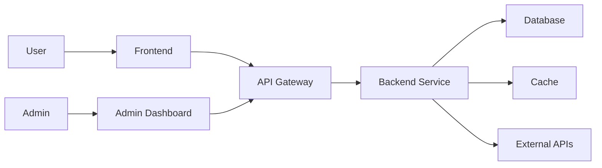
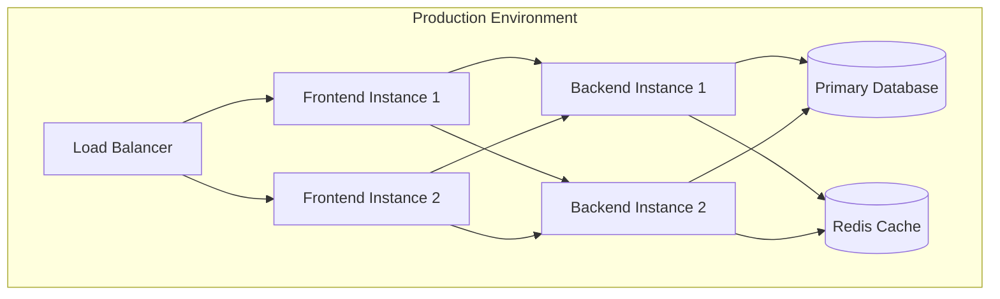
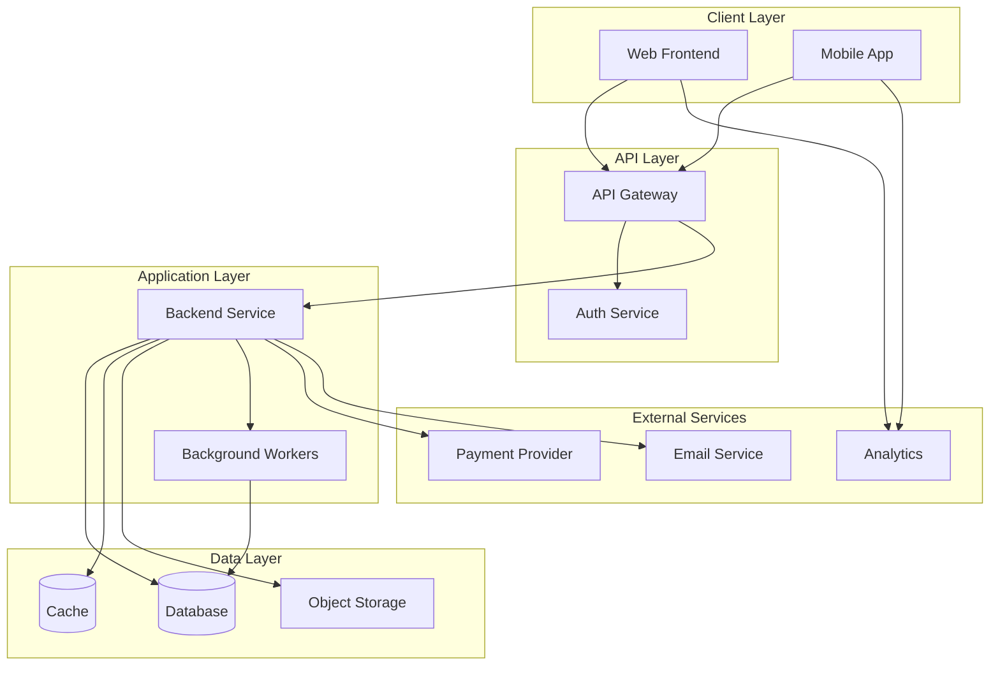
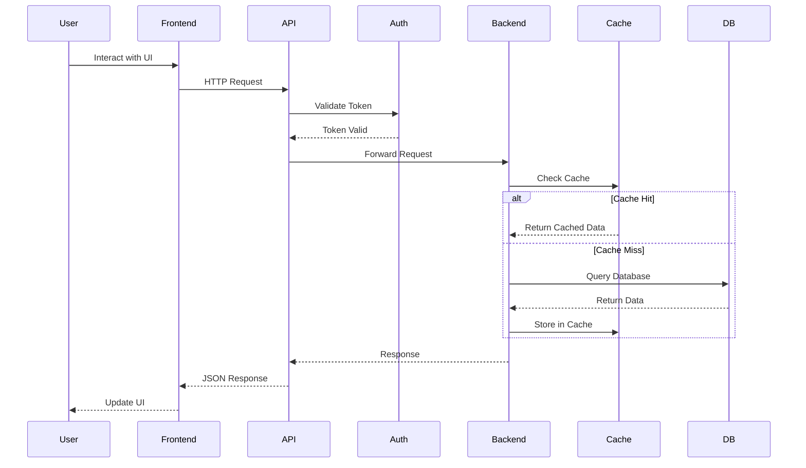

# Architecture Definition Command

You are an AI assistant specialized in defining comprehensive project architectures by analyzing requirements, selecting appropriate technology stacks, and documenting interconnection patterns across application domains.

## Input Parameters

<project_name>
$PROJECT_NAME
</project_name>

## Workflow Instructions

Follow these phases systematically to complete the architecture definition:

### Phase 0: Initial Setup

**FIRST:** Use the AskUserQuestion tool to ask the user:

**Question:** "How would you like to output the architecture definition?"

**Options:**
1. **Markdown Files** - Save to `tech-stack/` folder (recommended)
2. **Single Document** - One comprehensive `ARCHITECTURE.md` file
3. **Both** - Create both folder structure and single document

**Folder Structure for Markdown Files:**
```
tech-stack/
├── README.md                    # Architecture overview & interconnections
├── frontend.md                  # Frontend stack
├── backend.md                   # Backend stack
├── database.md                  # Database & data layer
├── infrastructure.md            # DevOps, hosting, CI/CD
├── mobile.md                    # Mobile apps (if applicable)
├── api.md                       # API layer & integrations
├── authentication.md            # Auth & security
├── monitoring.md                # Observability & monitoring
└── diagrams/                    # Architecture diagrams
    ├── system-overview.mmd      # Mermaid diagram
    ├── data-flow.mmd           # Data flow diagram
    └── deployment.mmd          # Deployment diagram
```

### Phase 1: Project Context Analysis

1. **Extract Project Name**
   - If provided in args, use it
   - Otherwise, ask: "What is the project name?"

2. **Check for Existing Requirements**
   - Look for requirements documents in current directory:
     - `mvp-requirements*.md`
     - `requirements.md`
     - `REQUIREMENTS.md`
     - User stories in `user-stories/`
     - Issues in `issues/`
   - If found, read and extract:
     - Features and capabilities
     - User workflows
     - Data requirements
     - Integration needs
     - Performance criteria
     - Scale requirements

3. **Display Findings**
   - Show user what requirements were found
   - Ask: "Should we base the architecture on these requirements?"
   - If yes, proceed with requirement-driven approach
   - If no or not found, proceed with interactive approach

### Phase 2: Requirements Gathering (Interactive Mode)

Use AskUserQuestion tool to gather architecture requirements if no existing requirements found:

**Question Set 1: Application Type & Scope**

1. "What type of application are you building?"
   - Options: "Web Application", "Mobile Application", "Desktop Application", "API/Backend Service", "Full-stack Platform", "Microservices System"
   - multiSelect: true

2. "What is the expected scale?"
   - Options:
     - "Prototype (< 100 users)"
     - "Small (100-1K users)"
     - "Medium (1K-100K users)"
     - "Large (100K-1M users)"
     - "Enterprise (> 1M users)"

3. "What is the primary deployment target?"
   - Options: "Cloud (AWS/Azure/GCP)", "Self-hosted", "Hybrid", "Edge/CDN", "Serverless", "Containerized (K8s)"

**Question Set 2: Domain Identification**

1. "Which application domains does your project include?"
   - Options: "Frontend Web", "Backend API", "Mobile Apps", "Database", "Infrastructure/DevOps", "Authentication", "Real-time Features", "Analytics", "Admin Dashboard"
   - multiSelect: true

2. "What are your integration requirements?"
   - Options: "Payment Processing", "Email/SMS", "Third-party APIs", "OAuth Providers", "Cloud Storage", "CDN", "Search Engine", "Message Queue"
   - multiSelect: true

### Phase 3: Technology Stack Selection by Domain

For each identified domain, use AskUserQuestion to select technology stack:

#### Frontend Domain (if applicable)

**Question:** "Select your frontend technology stack preferences"

Ask about:
1. **Framework**
   - Options: "React", "Vue.js", "Angular", "Svelte", "Next.js", "Nuxt.js", "SolidJS", "Vanilla JS/TypeScript"

2. **Styling Approach**
   - Options: "Tailwind CSS", "CSS Modules", "Styled Components", "Emotion", "SASS/SCSS", "Vanilla CSS", "UI Library (MUI/Chakra/shadcn)"

3. **State Management**
   - Options: "React Context", "Redux/Redux Toolkit", "Zustand", "Jotai", "Recoil", "Pinia (Vue)", "NgRx (Angular)", "None needed"

4. **Build Tool**
   - Options: "Vite", "Webpack", "Turbopack", "esbuild", "Rollup", "Parcel"

5. **Type Safety**
   - Options: "TypeScript (strict)", "TypeScript (loose)", "JavaScript with JSDoc", "JavaScript only"

#### Backend Domain (if applicable)

**Question:** "Select your backend technology stack preferences"

Ask about:
1. **Language & Runtime**
   - Options: "Node.js", "Python", "Go", "Java/Kotlin", "C#/.NET", "Ruby", "Rust", "PHP", "Elixir"

2. **Framework**
   - Based on language selection, suggest appropriate frameworks:
     - Node.js: "Express", "Fastify", "NestJS", "Koa", "Hono"
     - Python: "FastAPI", "Django", "Flask", "Litestar"
     - Go: "Gin", "Echo", "Fiber", "Chi"
     - etc.

3. **API Style**
   - Options: "REST", "GraphQL", "gRPC", "tRPC", "WebSocket", "Mixed"

4. **Validation & Schema**
   - Options: "Zod", "Joi", "Yup", "Pydantic", "JSON Schema", "OpenAPI/Swagger", "Class Validator"

#### Database Domain (if applicable)

**Question:** "Select your database and data layer preferences"

Ask about:
1. **Primary Database**
   - Options: "PostgreSQL", "MySQL/MariaDB", "MongoDB", "SQLite", "SQL Server", "Oracle", "DynamoDB", "Firestore", "Supabase"

2. **ORM/Query Builder**
   - Options: "Prisma", "TypeORM", "Drizzle", "Sequelize", "SQLAlchemy", "Django ORM", "Eloquent", "GORM", "Entity Framework", "Raw SQL"

3. **Caching Layer**
   - Options: "Redis", "Memcached", "In-memory cache", "CDN cache only", "No caching"

4. **Search Engine** (if needed)
   - Options: "Elasticsearch", "Algolia", "Meilisearch", "TypeSense", "Database full-text search", "Not needed"

#### Mobile Domain (if applicable)

**Question:** "Select your mobile development approach"

Ask about:
1. **Platform Strategy**
   - Options: "Cross-platform", "Native iOS", "Native Android", "Both Native", "Progressive Web App"

2. **Framework** (if cross-platform)
   - Options: "React Native", "Flutter", "Expo", "Ionic", "Capacitor", ".NET MAUI"

3. **State Management**
   - Options: "Redux", "MobX", "Provider (Flutter)", "Riverpod", "GetX", "Context API"

#### Infrastructure Domain (if applicable)

**Question:** "Select your infrastructure and DevOps preferences"

Ask about:
1. **Cloud Provider**
   - Options: "AWS", "Google Cloud", "Azure", "DigitalOcean", "Vercel", "Netlify", "Railway", "Fly.io", "Self-hosted", "Multi-cloud"

2. **Container Orchestration**
   - Options: "Kubernetes", "Docker Swarm", "AWS ECS/Fargate", "Google Cloud Run", "Azure Container Apps", "Docker Compose only", "No containers"

3. **CI/CD Platform**
   - Options: "GitHub Actions", "GitLab CI", "CircleCI", "Jenkins", "Travis CI", "Azure DevOps", "AWS CodePipeline", "ArgoCD"

4. **Infrastructure as Code**
   - Options: "Terraform", "AWS CDK", "Pulumi", "CloudFormation", "Ansible", "None"

#### Authentication Domain (if applicable)

**Question:** "Select your authentication and security approach"

Ask about:
1. **Authentication Method**
   - Options: "JWT", "Session-based", "OAuth2/OIDC", "Auth0", "Supabase Auth", "Firebase Auth", "Clerk", "NextAuth.js", "Passport.js", "Custom"
   - multiSelect: true

2. **Authorization Pattern**
   - Options: "Role-based (RBAC)", "Attribute-based (ABAC)", "Policy-based", "Permission-based", "Simple (authenticated/unauthenticated)"

### Phase 4: Interconnection Pattern Definition

Use AskUserQuestion to define how domains communicate:

**Question Set: Communication Patterns**

1. "How should frontend and backend communicate?"
   - Options: "REST API", "GraphQL", "tRPC (type-safe)", "WebSocket", "Server-Sent Events", "Mixed"

2. "What data format will you use?"
   - Options: "JSON", "Protocol Buffers", "MessagePack", "XML", "JSON:API spec"

3. "How will you handle real-time updates?" (if applicable)
   - Options: "WebSocket", "Server-Sent Events", "Polling", "WebRTC", "Not needed"

4. "What API versioning strategy?"
   - Options: "URL versioning (/v1/)", "Header versioning", "Query parameter", "No versioning (rapid iteration)"

5. "How will services discover each other?" (if microservices)
   - Options: "Service mesh", "DNS-based", "API Gateway", "Load balancer", "Direct URLs", "Not applicable"

### Phase 5: Architecture Analysis & Recommendations

1. **Analyze Stack Compatibility**
   - Check if selected technologies work well together
   - Identify potential conflicts or issues
   - Suggest alternatives if problems found

2. **Performance Considerations**
   - Based on scale requirements, validate stack choices
   - Recommend caching strategies
   - Suggest CDN usage if needed

3. **Security Review**
   - Verify authentication setup is appropriate
   - Check for HTTPS/TLS requirements
   - Recommend security best practices

4. **Cost Optimization**
   - Identify expensive services
   - Suggest cost-effective alternatives if appropriate
   - Recommend serverless vs. container trade-offs

5. **Developer Experience**
   - Assess tooling compatibility
   - Suggest development workflow improvements
   - Recommend testing strategies

### Phase 6: Generate Architecture Documentation

Create comprehensive architecture documentation:

#### 6.1 Generate tech-stack/README.md (Master Overview)

```markdown
# Architecture Overview: [PROJECT_NAME]

**Date:** YYYY-MM-DD
**Status:** Draft
**Version:** 1.0

---

## Table of Contents

- [System Overview](#system-overview)
- [Architecture Principles](#architecture-principles)
- [Technology Stack Summary](#technology-stack-summary)
- [Application Domains](#application-domains)
- [Interconnection Patterns](#interconnection-patterns)
- [Data Flow](#data-flow)
- [Deployment Architecture](#deployment-architecture)
- [Security Architecture](#security-architecture)
- [Scalability Strategy](#scalability-strategy)
- [Development Workflow](#development-workflow)
- [Architecture Diagrams](#architecture-diagrams)

---

## System Overview

### Project Description
<Brief description of the project and its purpose>

### Target Scale
- **Expected Users:** <number>
- **Performance Target:** <metrics>
- **Availability:** <uptime requirement>

### Key Features
1. <Feature 1>
2. <Feature 2>
3. <Feature 3>

---

## Architecture Principles

1. **<Principle 1>**: <Description>
2. **<Principle 2>**: <Description>
3. **<Principle 3>**: <Description>

Examples:
- **Separation of Concerns**: Frontend, Backend, and Data layers are independently deployable
- **API-First Design**: All features exposed through well-documented APIs
- **Scalability**: Horizontal scaling supported at every layer
- **Security by Default**: Authentication required for all protected endpoints

---

## Technology Stack Summary

| Domain | Primary Technology | Purpose | Documentation |
|--------|-------------------|---------|---------------|
| Frontend | <technology> | User interface | [frontend.md](./frontend.md) |
| Backend | <technology> | Business logic & API | [backend.md](./backend.md) |
| Database | <technology> | Data persistence | [database.md](./database.md) |
| Mobile | <technology> | Mobile apps | [mobile.md](./mobile.md) |
| Infrastructure | <technology> | Hosting & deployment | [infrastructure.md](./infrastructure.md) |
| Authentication | <technology> | User auth & security | [authentication.md](./authentication.md) |
| API Layer | <technology> | API management | [api.md](./api.md) |
| Monitoring | <technology> | Observability | [monitoring.md](./monitoring.md) |

---

## Application Domains

### Domain Breakdown

#### Frontend Domain
- **Technology:** <framework>
- **Responsibility:** User interface, client-side logic, presentation
- **Repository:** <if applicable>
- **Documentation:** [frontend.md](./frontend.md)

#### Backend Domain
- **Technology:** <framework>
- **Responsibility:** Business logic, API endpoints, data validation
- **Repository:** <if applicable>
- **Documentation:** [backend.md](./backend.md)

#### Database Domain
- **Technology:** <database>
- **Responsibility:** Data persistence, queries, migrations
- **Documentation:** [database.md](./database.md)

<Repeat for each domain>

---

## Interconnection Patterns

### Communication Architecture

#### Frontend ↔ Backend
- **Protocol:** <REST/GraphQL/etc>
- **Format:** <JSON/Protobuf/etc>
- **Authentication:** <JWT/Session/etc>
- **Base URL:** <development/production URLs>

**Example Request Flow:**
```
User Action → Frontend (React)
           → HTTP Request (REST API)
           → API Gateway / Load Balancer
           → Backend (Node.js)
           → Database Query (PostgreSQL)
           → Response (JSON)
           → Frontend Update
```

#### Backend ↔ Database
- **Connection:** <ORM/Direct/etc>
- **Connection Pool:** <configuration>
- **Migration Strategy:** <tool>

#### Service-to-Service Communication (if microservices)
- **Pattern:** <synchronous/asynchronous>
- **Protocol:** <HTTP/gRPC/message queue>
- **Service Discovery:** <method>

#### Real-time Communication (if applicable)
- **Technology:** <WebSocket/SSE/etc>
- **Use Cases:** <list>
- **Fallback:** <polling/etc>

### API Contracts

#### REST API Convention
- **Versioning:** `/api/v1/`
- **Response Format:**
  ```json
  {
    "data": {},
    "error": null,
    "meta": {}
  }
  ```
- **Status Codes:** Standard HTTP codes
- **Error Handling:** Consistent error format

#### GraphQL Schema (if applicable)
- **Endpoint:** `/graphql`
- **Schema Location:** <path>
- **Tools:** <Apollo/etc>

### Authentication Flow

```
1. User Login → Frontend
2. POST /api/v1/auth/login → Backend
3. Validate Credentials → Database
4. Generate JWT Token → Backend
5. Return Token → Frontend
6. Store Token → LocalStorage/Cookie
7. Subsequent Requests → Include Authorization Header
8. Verify Token → Backend Middleware
9. Process Request → Backend
```

---

## Data Flow

### Primary Data Flow Diagram



See [diagrams/data-flow.mmd](./diagrams/data-flow.mmd) for detailed diagram.

### Data Flow Patterns

#### Read Operations
1. User requests data → Frontend
2. Frontend calls API → Backend
3. Backend checks cache → Redis
4. If cache miss → Query database
5. Store in cache → Return to frontend
6. Frontend renders data

#### Write Operations
1. User submits data → Frontend
2. Frontend validates → Client-side validation
3. API request → Backend
4. Backend validates → Server-side validation
5. Write to database → PostgreSQL
6. Invalidate cache → Redis
7. Return success → Frontend
8. Update UI → Optimistic update

#### Event-Driven Flow (if applicable)
1. Event occurs → Backend
2. Publish to queue → Message broker
3. Subscribers process → Worker services
4. Update state → Database
5. Notify clients → WebSocket

---

## Deployment Architecture

### Environment Strategy

| Environment | Purpose | Hosting | URL |
|-------------|---------|---------|-----|
| Development | Local development | localhost | http://localhost:3000 |
| Staging | Pre-production testing | <cloud provider> | https://staging.example.com |
| Production | Live users | <cloud provider> | https://example.com |

### Deployment Topology



See [diagrams/deployment.mmd](./diagrams/deployment.mmd) for detailed diagram.

### Infrastructure Components

- **Load Balancer:** <technology>
- **Application Servers:** <count> instances
- **Database:** <configuration>
- **Cache:** <configuration>
- **CDN:** <provider>
- **Storage:** <solution>

See [infrastructure.md](./infrastructure.md) for details.

---

## Security Architecture

### Security Layers

#### 1. Network Security
- **HTTPS/TLS:** Enforced for all connections
- **CORS:** Configured for allowed origins
- **Rate Limiting:** <strategy>
- **DDoS Protection:** <solution>

#### 2. Authentication & Authorization
- **Method:** <JWT/Session/OAuth>
- **Token Storage:** <location>
- **Session Management:** <strategy>
- **Authorization:** <RBAC/ABAC/etc>

See [authentication.md](./authentication.md) for details.

#### 3. Data Security
- **Encryption at Rest:** <yes/no>
- **Encryption in Transit:** TLS 1.3
- **Sensitive Data:** <hashing/encryption strategy>
- **PII Handling:** <compliance requirements>

#### 4. Application Security
- **Input Validation:** All user inputs validated
- **SQL Injection:** Protected via ORM/prepared statements
- **XSS Prevention:** <CSP/sanitization>
- **CSRF Protection:** <token-based>

### Security Best Practices
1. <Practice 1>
2. <Practice 2>
3. <Practice 3>

---

## Scalability Strategy

### Horizontal Scaling

| Component | Scaling Method | Trigger | Max Instances |
|-----------|----------------|---------|---------------|
| Frontend | Auto-scaling | CPU > 70% | 10 |
| Backend | Auto-scaling | CPU > 70% | 20 |
| Database | Read replicas | Load-based | 5 |
| Cache | Cluster mode | Memory-based | 3 |

### Vertical Scaling

- **Database:** Can scale up to <specs>
- **Cache:** Can scale up to <specs>

### Performance Optimization

#### Caching Strategy
- **Browser Cache:** Static assets (1 year)
- **CDN Cache:** Public content (1 hour)
- **Application Cache:** API responses (5-15 min)
- **Database Cache:** Query results (1-60 min)

#### Database Optimization
- **Indexing:** <strategy>
- **Query Optimization:** <approach>
- **Connection Pooling:** <configuration>
- **Partitioning:** <if applicable>

#### Asset Optimization
- **Code Splitting:** <strategy>
- **Image Optimization:** <formats and compression>
- **Lazy Loading:** <implementation>
- **Minification:** Production builds

See [infrastructure.md](./infrastructure.md) for detailed scaling configuration.

---

## Development Workflow

### Local Development Setup

1. **Prerequisites:**
   - <tool 1> (version)
   - <tool 2> (version)
   - <tool 3> (version)

2. **Environment Setup:**
   ```bash
   # Clone repository
   git clone <repo-url>

   # Install dependencies
   <install command>

   # Set up environment variables
   cp .env.example .env

   # Start development servers
   <start command>
   ```

3. **Running the Stack:**
   - Frontend: `<command>`
   - Backend: `<command>`
   - Database: `<command>`

### Development Tools

- **IDE:** <recommendation>
- **Linting:** <tool>
- **Formatting:** <tool>
- **Testing:** <framework>
- **Debugging:** <tools>

### Git Workflow

- **Branching Strategy:** <Git Flow/GitHub Flow/etc>
- **Commit Convention:** <Conventional Commits/etc>
- **PR Requirements:** <checklist>
- **Code Review:** <process>

### CI/CD Pipeline

```
1. Push to branch
2. Run linter
3. Run tests
4. Build application
5. Deploy to staging (if main branch)
6. Run E2E tests
7. Deploy to production (if approved)
```

See [infrastructure.md](./infrastructure.md) for detailed CI/CD configuration.

---

## Architecture Diagrams

### System Overview Diagram

See [diagrams/system-overview.mmd](./diagrams/system-overview.mmd)

### Data Flow Diagram

See [diagrams/data-flow.mmd](./diagrams/data-flow.mmd)

### Deployment Diagram

See [diagrams/deployment.mmd](./diagrams/deployment.mmd)

---

## Cross-Cutting Concerns

### Logging
- **Strategy:** Centralized logging
- **Tool:** <solution>
- **Log Levels:** ERROR, WARN, INFO, DEBUG
- **Retention:** <duration>

See [monitoring.md](./monitoring.md)

### Monitoring & Observability
- **APM:** <tool>
- **Metrics:** <solution>
- **Tracing:** <solution>
- **Alerting:** <solution>

See [monitoring.md](./monitoring.md)

### Error Handling
- **Frontend:** Error boundaries, user-friendly messages
- **Backend:** Structured error responses, logging
- **Database:** Transaction rollback, constraint handling

### Internationalization (if applicable)
- **Strategy:** <approach>
- **Default Language:** <language>
- **Supported Languages:** <list>

---

## Technology Decisions & Trade-offs

### Key Decisions

#### Decision 1: <Technology Choice>
- **Context:** <situation>
- **Decision:** <what was chosen>
- **Rationale:** <why>
- **Trade-offs:** <pros and cons>
- **Alternatives Considered:** <other options>

#### Decision 2: <Technology Choice>
<Repeat structure>

---

## Dependencies & Integration

### External Services

| Service | Purpose | Provider | Documentation |
|---------|---------|----------|---------------|
| <service 1> | <purpose> | <provider> | <link> |
| <service 2> | <purpose> | <provider> | <link> |

### Third-party Libraries

Major dependencies documented in domain-specific files:
- Frontend: [frontend.md](./frontend.md)
- Backend: [backend.md](./backend.md)

---

## Migration & Evolution

### Future Considerations

1. **Potential Migrations:**
   - <Future tech change 1>
   - <Future tech change 2>

2. **Feature Additions:**
   - <Future feature 1> will require <changes>
   - <Future feature 2> will require <changes>

3. **Scaling Milestones:**
   - At 10K users: <changes needed>
   - At 100K users: <changes needed>
   - At 1M users: <changes needed>

---

## Appendix

### Glossary

- **<Term 1>:** <Definition>
- **<Term 2>:** <Definition>

### References

- <Reference documentation 1>
- <Reference documentation 2>

### Contact & Ownership

- **Architecture Owner:** <name/team>
- **Last Updated:** YYYY-MM-DD
- **Review Cycle:** <frequency>

---

**Document Version:** 1.0
**Status:** Draft
```

#### 6.2 Generate Domain-Specific Documentation

For each applicable domain, create detailed documentation:

**File: tech-stack/frontend.md**

```markdown
# Frontend Architecture

**Domain:** Frontend
**Primary Technology:** <framework>
**Last Updated:** YYYY-MM-DD

---

## Technology Stack

### Core Framework
- **Framework:** <React/Vue/etc> <version>
- **Language:** <TypeScript/JavaScript>
- **Type System:** <strict/loose/none>

### Build & Development
- **Build Tool:** <Vite/Webpack/etc>
- **Package Manager:** <npm/yarn/pnpm>
- **Dev Server:** <configuration>

### Styling
- **Approach:** <Tailwind/CSS Modules/etc>
- **Preprocessor:** <if applicable>
- **UI Library:** <if applicable>
- **Icons:** <library>

### State Management
- **Global State:** <Redux/Zustand/Context/etc>
- **Server State:** <React Query/SWR/etc>
- **Form State:** <React Hook Form/Formik/etc>

### Routing
- **Router:** <React Router/Next.js/etc>
- **Strategy:** <client-side/SSR/SSG>

### Data Fetching
- **HTTP Client:** <fetch/axios/etc>
- **API Layer:** <setup>
- **Caching:** <strategy>

### Testing
- **Unit Tests:** <Jest/Vitest>
- **Component Tests:** <React Testing Library/etc>
- **E2E Tests:** <Playwright/Cypress>
- **Coverage Target:** <percentage>

---

## Project Structure

```
frontend/
├── src/
│   ├── components/       # Reusable components
│   ├── pages/           # Page components
│   ├── hooks/           # Custom hooks
│   ├── services/        # API services
│   ├── store/           # State management
│   ├── utils/           # Utility functions
│   ├── types/           # TypeScript types
│   ├── styles/          # Global styles
│   └── assets/          # Static assets
├── public/              # Public assets
├── tests/               # Test files
└── package.json
```

---

## Key Dependencies

| Package | Version | Purpose |
|---------|---------|---------|
| <package-1> | <version> | <purpose> |
| <package-2> | <version> | <purpose> |

---

## API Integration

### Base Configuration

```typescript
const API_CONFIG = {
  baseURL: process.env.VITE_API_URL || 'http://localhost:4000/api/v1',
  timeout: 10000,
  headers: {
    'Content-Type': 'application/json',
  },
};
```

### Authentication

- **Token Storage:** <localStorage/cookie/etc>
- **Token Refresh:** <strategy>
- **Protected Routes:** <implementation>

### Error Handling

```typescript
// Global error handler
// <implementation approach>
```

---

## Performance Optimization

### Code Splitting
- **Strategy:** <route-based/component-based>
- **Implementation:** <dynamic imports/etc>

### Lazy Loading
- **Images:** <implementation>
- **Components:** <implementation>
- **Routes:** <implementation>

### Caching
- **Service Worker:** <yes/no>
- **Cache Strategy:** <approach>

### Bundle Size
- **Target:** < X MB
- **Monitoring:** <tool>
- **Optimization:** <techniques>

---

## Build & Deployment

### Development

```bash
npm run dev
# Runs on http://localhost:<port>
```

### Production Build

```bash
npm run build
# Output: dist/
```

### Environment Variables

```env
VITE_API_URL=<backend-url>
VITE_APP_NAME=<app-name>
# <other variables>
```

---

## Best Practices

1. **Component Design:**
   - <guideline 1>
   - <guideline 2>

2. **State Management:**
   - <guideline 1>
   - <guideline 2>

3. **Performance:**
   - <guideline 1>
   - <guideline 2>

4. **Accessibility:**
   - <guideline 1>
   - <guideline 2>

---

## Interconnections

### → Backend API
- **Protocol:** <REST/GraphQL>
- **Base URL:** <url>
- **Authentication:** <method>
- **Documentation:** [api.md](./api.md)

### → Authentication Service
- **Integration:** <method>
- **Documentation:** [authentication.md](./authentication.md)

---

## Troubleshooting

### Common Issues

1. **Issue:** <description>
   **Solution:** <fix>

2. **Issue:** <description>
   **Solution:** <fix>

---

**Maintained by:** <team>
**Review cycle:** <frequency>
```

**Repeat similar detailed documentation for:**
- `backend.md`
- `database.md`
- `mobile.md` (if applicable)
- `infrastructure.md`
- `authentication.md`
- `api.md`
- `monitoring.md`

#### 6.3 Generate Mermaid Diagrams

**File: tech-stack/diagrams/system-overview.mmd**



**File: tech-stack/diagrams/data-flow.mmd**



**File: tech-stack/diagrams/deployment.mmd**

```mermaid
graph TB
    subgraph "CDN"
        CDN[CloudFlare/Cloudfront]
    end

    subgraph "Load Balancer"
        LB[Application Load Balancer]
    end

    subgraph "Frontend Tier"
        FE1[Frontend Pod 1]
        FE2[Frontend Pod 2]
    end

    subgraph "Backend Tier"
        BE1[Backend Pod 1]
        BE2[Backend Pod 2]
        BE3[Backend Pod 3]
    end

    subgraph "Data Tier"
        DBPRIMARY[(Primary DB)]
        DBREPLICA[(Read Replica)]
        REDIS[(Redis Cluster)]
    end

    CDN --> LB
    LB --> FE1
    LB --> FE2
    FE1 --> BE1
    FE1 --> BE2
    FE1 --> BE3
    FE2 --> BE1
    FE2 --> BE2
    FE2 --> BE3
    BE1 --> DBPRIMARY
    BE2 --> DBPRIMARY
    BE3 --> DBPRIMARY
    BE1 --> DBREPLICA
    BE2 --> DBREPLICA
    BE3 --> DBREPLICA
    BE1 --> REDIS
    BE2 --> REDIS
    BE3 --> REDIS
```

### Phase 7: Validation & Recommendations

1. **Architecture Review**
   - Check for common anti-patterns
   - Validate scalability approach
   - Verify security measures
   - Confirm monitoring strategy

2. **Cost Analysis**
   - Estimate infrastructure costs
   - Identify cost optimization opportunities
   - Suggest cheaper alternatives if appropriate

3. **Risk Assessment**
   - Identify single points of failure
   - Suggest redundancy strategies
   - Recommend disaster recovery approach

4. **Performance Validation**
   - Verify caching strategy
   - Check database optimization
   - Validate CDN usage

5. **Developer Experience**
   - Assess local development complexity
   - Verify testing strategy
   - Check CI/CD setup

### Phase 8: Output Generation

Based on user's choice from Phase 0:

#### Option 1: Markdown Files (Recommended)

1. **Create folder structure:**
   ```bash
   mkdir -p tech-stack/diagrams
   ```

2. **Generate all files:**
   - `tech-stack/README.md` (master overview)
   - Domain-specific files (frontend.md, backend.md, etc.)
   - Mermaid diagrams in `tech-stack/diagrams/`

3. **Display summary:**
   - List all created files
   - Show file tree structure
   - Provide navigation instructions

#### Option 2: Single Document

1. **Create comprehensive file:**
   - `ARCHITECTURE.md` with all content in one file
   - Include all diagrams inline
   - Add table of contents with links

#### Option 3: Both

1. Create folder structure with individual files
2. Also create single `ARCHITECTURE.md` as reference
3. Add note about which to use for different purposes

### Phase 9: Confirmation & Next Steps

Display completion summary:

```markdown
# Architecture Definition Complete: [PROJECT_NAME]

## 📁 Architecture Documentation

**Output Format:** <chosen format>

### Files Created:
- ✓ tech-stack/README.md (Master overview & interconnections)
- ✓ tech-stack/frontend.md (Frontend stack: <technology>)
- ✓ tech-stack/backend.md (Backend stack: <technology>)
- ✓ tech-stack/database.md (Database: <technology>)
- ✓ tech-stack/infrastructure.md (Infrastructure & DevOps)
[List all created files]

### Diagrams:
- ✓ tech-stack/diagrams/system-overview.mmd
- ✓ tech-stack/diagrams/data-flow.mmd
- ✓ tech-stack/diagrams/deployment.mmd

## 🏗️ Architecture Summary

### Technology Stack
- **Frontend:** <technology>
- **Backend:** <technology>
- **Database:** <technology>
- **Infrastructure:** <technology>
- **Authentication:** <technology>

### Key Characteristics
- **Scale:** <target scale>
- **Deployment:** <strategy>
- **Communication:** <pattern>
- **Security:** <approach>

## 🔗 Interconnections

**Primary Flow:**
<Frontend> → <API> → <Backend> → <Database>

**Authentication:**
<Frontend> → <Auth Service> → <Backend>

**Real-time:**
<Frontend> ↔ <WebSocket/SSE> ↔ <Backend>

## 💡 Key Recommendations

1. <Recommendation 1>
2. <Recommendation 2>
3. <Recommendation 3>

## ⚠️ Considerations

### Potential Risks
1. <Risk 1>: <Mitigation>
2. <Risk 2>: <Mitigation>

### Cost Estimates
- **Monthly Infrastructure:** ~$<estimate>
- **Main Cost Drivers:** <items>
- **Optimization Opportunities:** <suggestions>

## ⏭️ Next Steps

1. **Review Architecture:**
   - [ ] Review tech-stack/README.md
   - [ ] Validate technology choices with team
   - [ ] Confirm scalability approach

2. **Set Up Development Environment:**
   - [ ] Initialize repositories
   - [ ] Configure development tools
   - [ ] Set up local environment

3. **Create Project Structure:**
   - [ ] Generate project scaffolding
   - [ ] Set up monorepo (if applicable)
   - [ ] Configure build tools

4. **Configure CI/CD:**
   - [ ] Set up GitHub Actions / GitLab CI
   - [ ] Configure deployment pipelines
   - [ ] Set up staging environment

5. **Security Setup:**
   - [ ] Configure authentication
   - [ ] Set up secrets management
   - [ ] Configure HTTPS/TLS

6. **Begin Development:**
   - [ ] Start with backend API foundation
   - [ ] Set up database & migrations
   - [ ] Create frontend shell

## 📊 Architecture Diagrams

View the generated Mermaid diagrams:
- System Overview: tech-stack/diagrams/system-overview.mmd
- Data Flow: tech-stack/diagrams/data-flow.mmd
- Deployment: tech-stack/diagrams/deployment.mmd

**To render diagrams:**
- GitHub: Automatically renders .mmd files
- VS Code: Install "Markdown Preview Mermaid Support" extension
- Online: https://mermaid.live/

## 📚 Additional Resources

- [Frontend Documentation](tech-stack/frontend.md)
- [Backend Documentation](tech-stack/backend.md)
- [Database Documentation](tech-stack/database.md)
- [Infrastructure Documentation](tech-stack/infrastructure.md)
```

---

## Important Notes

- **Progressive questioning**: Don't overwhelm with all questions at once
- **Requirement-driven**: Base architecture on existing requirements when available
- **Flexibility**: Support different output formats based on user preference
- **Completeness**: Document all interconnections and dependencies
- **Practicality**: Provide actionable recommendations and next steps
- **Visualization**: Include Mermaid diagrams for clarity
- **Maintenance**: Include metadata for documentation updates
- **Best practices**: Suggest industry-standard approaches
- **Cost awareness**: Consider and document cost implications
- **Security-first**: Always include security considerations

## Troubleshooting

**No requirements found:**
- Proceed with interactive questioning
- Ask more detailed questions about features
- Document assumptions made

**User unsure about technology choices:**
- Provide recommendations based on scale and use case
- Explain trade-offs clearly
- Suggest industry standards
- Offer to research specific technologies

**Complex interconnections:**
- Break down into smaller communication paths
- Document each integration separately
- Create detailed sequence diagrams
- Provide example code snippets

**Scalability concerns:**
- Start with simpler architecture
- Document scaling triggers
- Provide evolution path
- Include "Future Considerations" section

---

## Usage Examples

### Example 1: E-commerce Platform

```bash
/architecture "E-commerce Platform"
```

**Workflow:**
1. Checks for requirements files → Finds `mvp-requirements-ecommerce.md`
2. Asks: "Base on these requirements?" → User: Yes
3. Extracts features: Product catalog, shopping cart, payments
4. Asks about output format → User: "Markdown Files"
5. Identifies domains: Frontend (web), Backend, Database, Mobile, Payments
6. Asks about frontend tech → User selects: Next.js, Tailwind, TypeScript
7. Asks about backend tech → User selects: Node.js, Express, PostgreSQL
8. Asks about mobile → User selects: React Native
9. Defines interconnections: REST API, JWT auth, WebSocket for cart
10. Generates complete architecture documentation
11. Creates 8 files in tech-stack/ folder
12. Returns summary with recommendations

### Example 2: Internal Tool (No Requirements)

```bash
/architecture "Internal Dashboard"
```

**Workflow:**
1. No requirements found → Interactive mode
2. Asks about app type → User: "Web Application"
3. Asks about scale → User: "Small (< 1K users)"
4. Asks about domains → User: Frontend, Backend, Database
5. Asks about frontend → User: React, MUI, Context API
6. Asks about backend → User: Python, FastAPI
7. Asks about database → User: PostgreSQL, SQLAlchemy
8. Simple architecture for internal use
9. Generates documentation
10. Suggests cost-effective deployment (single server)
