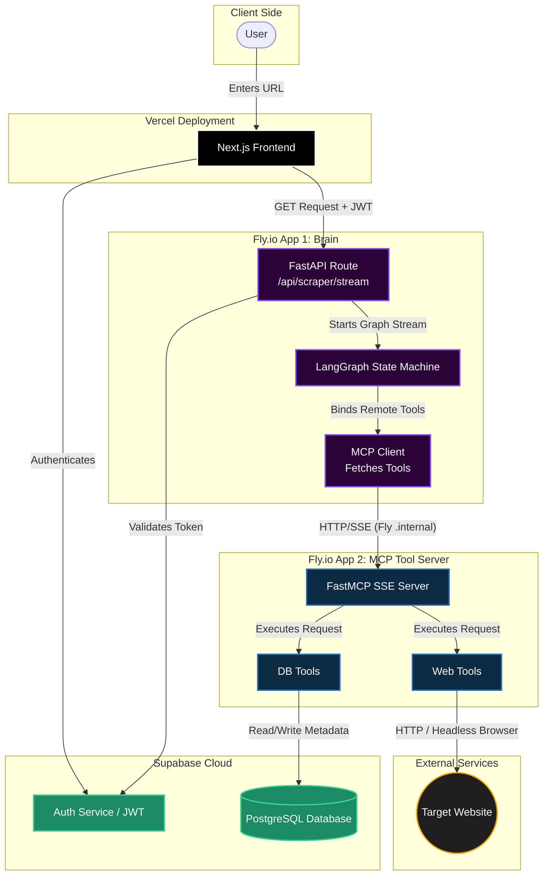

# Decentralized AI Agent Architecture Guide

## 1. System Overview

This repository defines a distributed, microservice-based AI architecture. It separates the **Brain** (the LLM orchestration and state management) from the **Hands** (the tools, database connections, and side-effects).

By decoupling these services, we can scale the heavy data-processing workers independently from the lightweight reasoning engines, and easily add new specialized agents to the cluster in the future.

### Tech Stack

| Component | Technology | Deployment |
|---|---|---|
| Frontend | Next.js | Vercel |
| Brain | FastAPI + LangGraph + langchain-mcp-adapters + Gemini / Groq / OpenAI / Anthropic / Mistral | Fly.io |
| Hands (Tool Server) | FastMCP | Fly.io |
| Database & Auth | Supabase (PostgreSQL + JWT) | Supabase Cloud |
| Web Scraping | httpx + BeautifulSoup (with Playwright headless fallback) | Local |
| Internal Communication | Server-Sent Events (SSE) over Fly.io private IPv6 network | Fly.io |

## 2. Architecture Flow



## 3. Monorepo Directory Structure

Both applications live in the same codebase but have separate `fly.toml` files for isolated microservice deployment.

```
quipu/
├── brain/                   # The Brain (FastAPI + LangGraph)
│   ├── __init__.py
│   ├── agents/
│   │   └── registry.py      # Agent definition registry
│   ├── workflows/
│   │   ├── schema.py        # Workflow DAG schema (Pydantic)
│   │   └── engine.py        # Workflow execution engine
│   ├── chat_graph.py        # Chat agent LangGraph definition
│   ├── extraction_graph.py  # Structured extraction pipeline
│   ├── dependencies.py      # Supabase JWT verification
│   ├── graph.py             # Scraper LangGraph Nodes, Edges, and State
│   ├── logging.py           # Structured logging (structlog)
│   ├── mcp_registry.py      # Multi-Hands MCP connection manager
│   ├── models.py            # Multi-provider LLM factory (BYOK support)
│   ├── rate_limit.py        # Per-user rate limiting
│   ├── schemas.py           # Request/response Pydantic models
│   ├── server.py            # FastAPI initialization & routing
│   ├── webhooks.py          # HMAC-authenticated webhook triggers
│   ├── pyproject.toml       # Package dependencies
│   ├── Dockerfile
│   └── fly.toml             # Fly.io deployment config
├── hands/                   # The Hands (FastMCP)
│   ├── tools/
│   │   ├── db_tools.py      # Supabase Asyncpg logic
│   │   ├── web_tools.py     # Web scraping (httpx + Playwright fallback)
│   │   ├── conversation_tools.py  # Conversation persistence
│   │   ├── run_tools.py     # Agent run history
│   │   ├── key_tools.py     # BYOK encrypted key management
│   │   ├── notification_tools.py  # Email, Slack, webhook notifications
│   │   ├── webhook_tools.py # Webhook registration CRUD
│   │   ├── file_tools.py    # File upload, parsing, chunking
│   │   └── user_server_tools.py   # User MCP server registration
│   ├── auth.py              # Token auth for self-hosted instances
│   ├── logging.py           # Structured logging (structlog)
│   ├── server.py            # FastMCP initialization
│   ├── pyproject.toml       # Package dependencies
│   ├── Dockerfile
│   └── fly.toml             # Fly.io deployment config
├── migrations/              # SQL migration files
│   ├── 001_scraped_metadata.sql
│   ├── 001_conversations.sql
│   ├── 002_runs.sql
│   ├── 003_user_api_keys.sql
│   ├── 004_webhooks.sql
│   ├── 005_files.sql
│   └── 006_user_mcp_servers.sql
├── docs/                    # Project documentation
│   ├── architecture.md      # This file
│   ├── multi-model.md       # Multi-model support
│   ├── sse-protocol.md      # SSE event format
│   └── migrations.md        # Migration process
├── pyproject.toml           # Root workspace config (uv)
└── .gitignore
```

## 4. Service 1: Hands (`hands/`)

The tool server knows nothing about AI, prompts, or agents. It purely exposes Python functions as typed, standardized tools over SSE. Current tool categories: database operations, web scraping, conversation persistence, agent run history, BYOK key management, notifications (email/Slack/webhook), file handling, webhook registration, and user MCP server registration.

**Entry point:** `hands/server.py`
**Port:** 8080
**Transport:** SSE (exposed at `/sse`)

### Environment Variables

| Variable | Description |
|---|---|
| `SUPABASE_DB_URL` | PostgreSQL connection string |
| `KEY_ENCRYPTION_KEY` | Fernet symmetric key for BYOK API key encryption |
| `HANDS_AUTH_TOKEN` | Optional bearer token for self-hosted Hands auth |
| `SENDGRID_API_KEY` | SendGrid API key (for email notifications) |

## 5. Service 2: Brain (`brain/`)

The core reasoning engine. On startup, it connects to the MCP Tool Server to discover available actions, then uses LangGraph to orchestrate the LLM and tools.

The Brain is designed to manage multiple specialized agents. The current scraper agent is the first. Future agents will share the same FastAPI app, MCP tool discovery, and authentication infrastructure while adding their own LangGraph definitions and endpoints.

### Key Components

- **`server.py`** - FastAPI app with lifespan-managed MCP connections, SSE streaming endpoints for chat, scraping, extraction, and workflows
- **`graph.py`** - LangGraph state machine with reasoning and tool execution nodes
- **`chat_graph.py`** - Chat agent with conversation persistence and agent definitions
- **`extraction_graph.py`** - Structured data extraction pipeline
- **`models.py`** - Multi-provider LLM factory (Google, Groq, OpenAI, Anthropic, Mistral) with BYOK support
- **`mcp_registry.py`** - Multi-Hands MCP connection manager with health checks and tool deduplication
- **`workflows/`** - DAG-based workflow engine with conditional branching
- **`webhooks.py`** - HMAC-SHA256 authenticated webhook trigger endpoints
- **`agents/registry.py`** - Named agent definitions with custom system prompts
- **`rate_limit.py`** - Per-user sliding-window rate limiting
- **`logging.py`** - Structured JSON logging via structlog
- **`dependencies.py`** - Supabase JWT verification middleware

**Entry point:** `brain/server.py`
**Port:** 8000
**Uvicorn command:** `uvicorn brain.server:app`

### Environment Variables

| Variable | Description |
|---|---|
| `GOOGLE_API_KEY` | Google AI API key for Gemini |
| `GROQ_API_KEY` | Groq API key for Llama models |
| `OPENAI_API_KEY` | OpenAI API key for GPT models |
| `ANTHROPIC_API_KEY` | Anthropic API key for Claude models |
| `MISTRAL_API_KEY` | Mistral API key |
| `SUPABASE_JWT_SECRET` | JWT secret for token verification |
| `MCP_SERVER_URL` | URL to single MCP tool server (e.g., `http://your-hands.internal:8080/sse`) |
| `MCP_SERVERS` | JSON array for multi-Hands (e.g., `[{"name":"main","url":"http://..."}]`) |

## 6. Deployment Strategy (Fly.io)

### Tool Server (The Hands)

- **App Name:** `quipu-hands`
- **Port:** 8080
- **Public IP:** Not required (internal only)
- **VM:** `shared-cpu-1x`, 256 MB RAM

### Brain

- **App Name:** `quipu-brain`
- **Port:** 8000 (publicly exposed over HTTPS)
- **VM:** `shared-cpu-1x`, 256 MB RAM
- **Key env var:** `MCP_SERVER_URL="http://quipu-hands.internal:8080/sse"`

The `.internal` address ensures the Brain communicates with the Tool Server entirely within Fly.io's secure, low-latency backend network.

## 7. Internal Communication

Services communicate over Fly.io's private IPv6 network using SSE. The Brain acts as an MCP client that connects to the Tool Server's SSE endpoint at startup to discover available tools. This architecture allows:

- **Independent scaling** - Heavy data-processing workers scale separately from reasoning engines
- **Tool isolation** - The Tool Server has no knowledge of AI/LLM concerns
- **Dynamic discovery** - New tools added to the MCP server are automatically available to the Brain

## 8. Multi-Hands Architecture

The Brain supports connecting to multiple Hands instances via `MCPRegistry`. This enables:

- **Scaling tool servers independently** — separate Hands for database-heavy vs. scraping-heavy workloads
- **User-registered Hands** — users can register their own self-hosted MCP servers with token auth
- **Tool deduplication** — tools with the same name across servers are deduplicated automatically
- **Health monitoring** — per-server health checks via `registry.health_check_all()`

Configure via `MCP_SERVERS` env var (JSON array) or the backward-compatible `MCP_SERVER_URL` for a single server.

## 9. Workflow Engine

The workflow engine (`brain/workflows/`) enables multi-step DAG execution:

- **Schema** (`schema.py`): `WorkflowDefinition` → `WorkflowStep` → `WorkflowCondition`
- **Engine** (`engine.py`): Executes steps sequentially, passes output via `{input}` template, evaluates conditions for branching
- **Conditions**: `equals`, `contains`, `exists`, `not_exists` operators on JSON output fields
- **Safety**: `max_steps` guard prevents infinite loops (default: 20)

## 10. Future Direction

The platform now supports multiple agent types (scraper, chat, extraction), a workflow engine for multi-step pipelines, BYOK for user-provided API keys, and multi-Hands deployment. Future work may include workflow persistence, scheduled runs, and a visual workflow builder UI.
