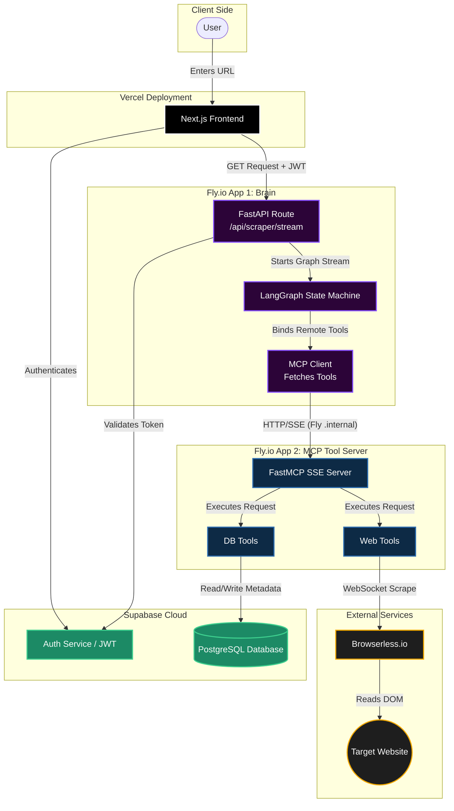

# Decentralized AI Agent Architecture Guide

## 1. System Overview

This repository defines a distributed, microservice-based AI architecture. It separates the **Brain** (the LLM orchestration and state management) from the **Hands** (the tools, database connections, and side-effects).

By decoupling these services, we can scale the heavy data-processing workers independently from the lightweight reasoning engines, and easily add new specialized agents to the cluster in the future.

### Tech Stack

| Component | Technology | Deployment |
|---|---|---|
| Frontend | Next.js | Vercel |
| Brain | FastAPI + LangGraph + langchain-mcp-adapters + Gemini | Fly.io |
| Hands (Tool Server) | FastMCP | Fly.io |
| Database & Auth | Supabase (PostgreSQL + JWT) | Supabase Cloud |
| Web Scraping | Browserless.io (Playwright over WebSocket) | External |
| Internal Communication | Server-Sent Events (SSE) over Fly.io private IPv6 network | Fly.io |

## 2. Architecture Flow



## 3. Monorepo Directory Structure

Both applications live in the same codebase but have separate `fly.toml` files for isolated microservice deployment.

```
quipu/
├── brain/                   # The Brain (FastAPI + LangGraph)
│   ├── __init__.py
│   ├── dependencies.py      # Supabase JWT verification
│   ├── graph.py             # LangGraph Nodes, Edges, and State
│   ├── server.py            # FastAPI initialization & MCP Client setup
│   ├── pyproject.toml       # Package dependencies
│   ├── Dockerfile
│   └── fly.toml             # Fly.io deployment config
├── hands/                   # The Hands (FastMCP)
│   ├── tools/
│   │   ├── db_tools.py      # Supabase Asyncpg logic
│   │   └── web_tools.py     # Browserless Playwright logic
│   ├── server.py            # FastMCP initialization
│   ├── pyproject.toml       # Package dependencies
│   ├── Dockerfile
│   └── fly.toml             # Fly.io deployment config
├── docs/                    # Project documentation
│   └── architecture.md      # This file
├── pyproject.toml           # Root workspace config (uv)
└── .gitignore
```

## 4. Service 1: Hands (`hands/`)

The tool server knows nothing about AI, prompts, or agents. It purely exposes Python functions as typed, standardized tools over SSE.

**Entry point:** `hands/server.py`
**Port:** 8080
**Transport:** SSE (exposed at `/sse`)

### Environment Variables

| Variable | Description |
|---|---|
| `SUPABASE_DB_URL` | PostgreSQL connection string |
| `BROWSERLESS_API_KEY` | Browserless.io API key |

## 5. Service 2: Brain (`brain/`)

The core reasoning engine. On startup, it connects to the MCP Tool Server to discover available actions, then uses LangGraph to orchestrate the LLM and tools.

The Brain is designed to manage multiple specialized agents. The current scraper agent is the first. Future agents will share the same FastAPI app, MCP tool discovery, and authentication infrastructure while adding their own LangGraph definitions and endpoints.

### Key Components

- **`server.py`** - FastAPI app with lifespan-managed MCP client connection, SSE streaming endpoint
- **`graph.py`** - LangGraph state machine with reasoning and tool execution nodes
- **`dependencies.py`** - Supabase JWT verification middleware

**Entry point:** `brain/server.py`
**Port:** 8000
**Uvicorn command:** `uvicorn brain.server:app`

### Environment Variables

| Variable | Description |
|---|---|
| `GOOGLE_API_KEY` | Google AI API key for Gemini |
| `SUPABASE_JWT_SECRET` | JWT secret for token verification |
| `MCP_SERVER_URL` | URL to MCP tool server (e.g., `http://your-hands.internal:8080/sse`) |

## 6. Deployment Strategy (Fly.io)

### Tool Server (The Hands)

- **App Name:** `quipu-hands`
- **Port:** 8080
- **Public IP:** Not required (internal only)
- **VM:** `shared-cpu-1x`, 256 MB RAM

### Brain

- **App Name:** `quipu-brain`
- **Port:** 8000 (publicly exposed over HTTPS)
- **VM:** `shared-cpu-1x`, 256 MB RAM
- **Key env var:** `MCP_SERVER_URL="http://quipu-hands.internal:8080/sse"`

The `.internal` address ensures the Brain communicates with the Tool Server entirely within Fly.io's secure, low-latency backend network.

## 7. Internal Communication

Services communicate over Fly.io's private IPv6 network using SSE. The Brain acts as an MCP client that connects to the Tool Server's SSE endpoint at startup to discover available tools. This architecture allows:

- **Independent scaling** - Heavy data-processing workers scale separately from reasoning engines
- **Tool isolation** - The Tool Server has no knowledge of AI/LLM concerns
- **Dynamic discovery** - New tools added to the MCP server are automatically available to the Brain

## 8. Future Direction

The `brain/` package will evolve to manage multiple specialized agents beyond the current scraper. Each agent will have its own LangGraph definition and API endpoints while sharing the common infrastructure (FastAPI app, MCP tool discovery, JWT authentication). This multi-agent architecture enables adding new capabilities without modifying existing agent logic.
